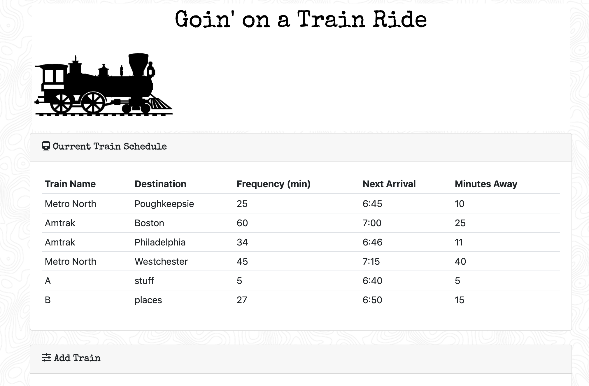

# Train-Scheduler

### A fun way to keep tabs on upcoming train trips, like a to-do list that updates arrival times for you. All you need to know is your destination, train, time the train starts, and the time between trains and you've got yourself your very own trip planner!
----------------------------------------------------------------------------------------
### This front-end with firebase back-end project was to create the ability for a user to enter in train times they wanted to remember and be able to notice how many minutes away it will be. The Firebase on the back-end holds the data entered for save keeping. This was also my first time using moment to help make the train times look nice. 
----------------------------------------------------------------------------------------

----------------------------------------------------------------------------------------

### Technology Used
#### * HTML
#### * CSS
#### * Javascript and jQuery
#### * Firebase
#### * Moment.js

#### I am the sole contributor to this application